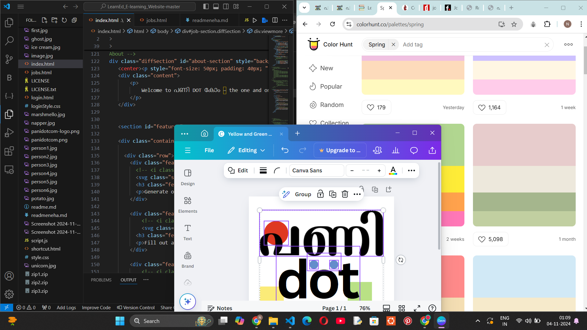
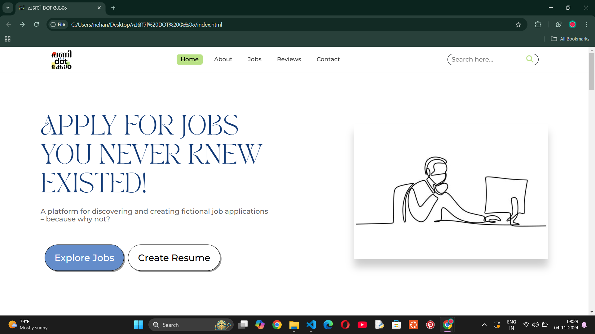
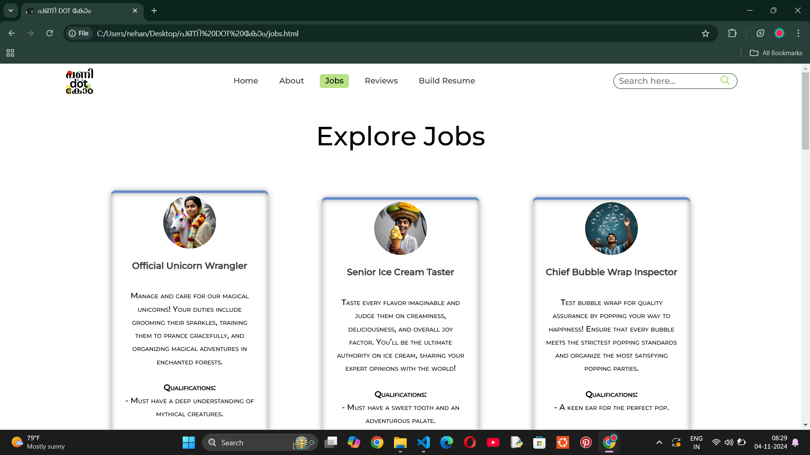
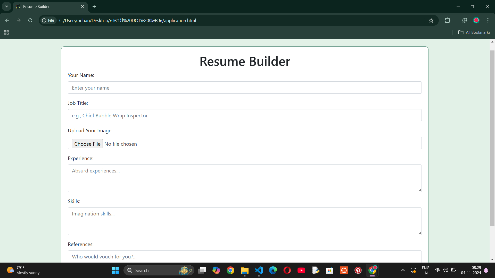
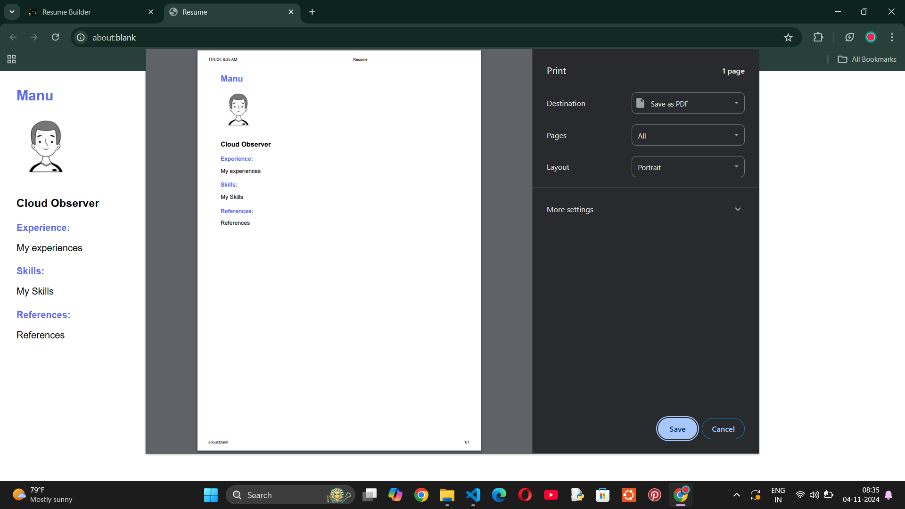

# പണി DOT കോ൦ 🎯

## Basic Details
### Team Name: Neha TK's Team

### Team Members
- Team Lead: Neha TK - Government Engineering College Kozhikode

### Project Description
This platform is a playful space where users can create and apply for completely fictional jobs, adding a touch of humor to the serious world of career building. It lets users explore imaginative, whimsical roles, fill out creative application forms, and even craft and download unique resumes for these dream-like positions. By combining humor with creativity, this project offers a way to de-stress, have fun, and celebrate the limitless potential of our imaginations.

### The Problem (that doesn’t exist)
The world lacks a place where people can explore job titles from their wildest dreams! Ever imagined being a "Nap Consultant" or "Chief Plant Waterer"? There’s never been a platform for expressing these ridiculous, fun ideas – until now.

### The Solution (that nobody asked for)
We've built a platform where users can submit, browse, and even "apply" for jobs they’ll never find on regular job boards. It brings humor and creativity to an otherwise serious space, inviting people to laugh, unwind, and dream up the most outlandish career paths.

## Technical Details
### Technologies/Components Used

For Software:
- **Languages Used**: HTML, CSS, JavaScript
- **Libraries Used**: Bootstrap (for styling), FontAwesome (for icons)
- **Tools Used**: Git (version control), Canva (graphic design)

For Hardware:
- *Not applicable* (Purely software-based)

# Screenshots

1. 
   *This is the main working image showing the core functionality of the application.*

2. 
   *Homepage – Displays the main interface with options to explore fictional job categories.*

3. 
   *All Jobs Listed Page – Shows a comprehensive list of all available fictional job titles.*

4. 
   *Resume Building Page – The interface where users can fill out their information to create a resume.*

5. 
   *Built Resume in PDF Format – Preview of the generated resume that users can download.*

## Team Contributions
- Neha TK: Full contributions
---

Made with ❤️ at TinkerHub Useless Projects 

